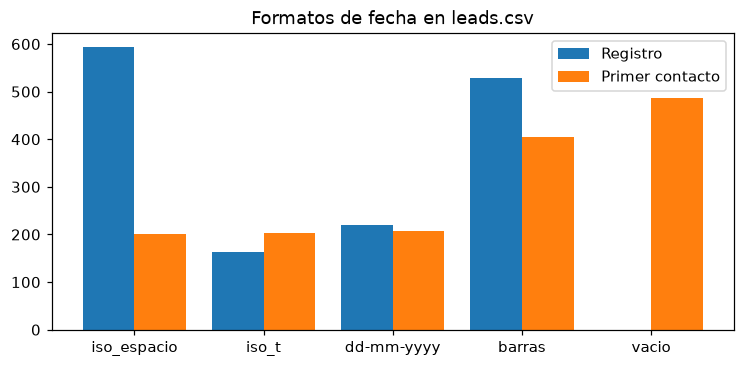
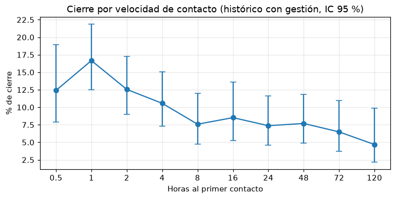
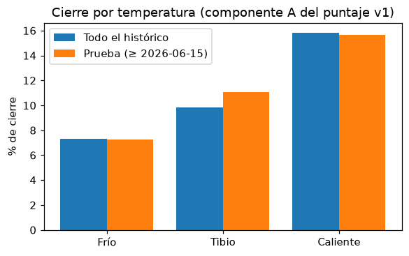
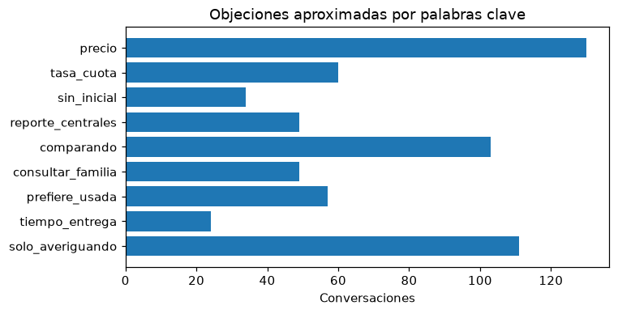
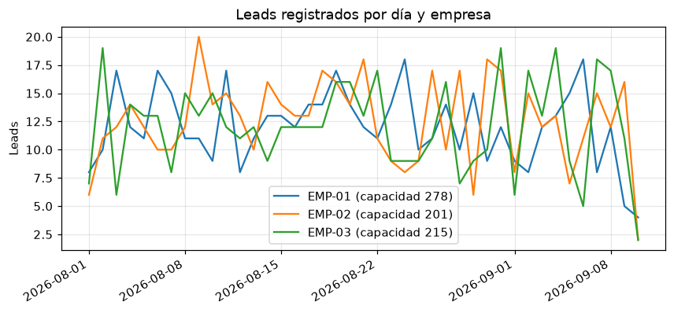

# EDA — Priorizador Diario de Leads

> Documento generado con `uv run python -m eda` a partir de `data/raw/`. **No se edita a mano.**
> Las cifras de este documento salen del código de `eda/`; dos ejecuciones producen el mismo resultado.

## Resumen

- Verificación de cifras: **34 coinciden**, **5 no coinciden** y 4 son informativas (sección 3).
- Leads únicos analizados: 1.500 (sin filas con `lead_id` repetido ni registros de prueba). Histórico: 2.200 registros entre 2026-03-01 y 2026-07-28.
- Las discrepancias no se ajustaron: se reportan con su causa probable y una corrección propuesta (sección 8).

## 1. Perfil de los archivos

#### `leads.csv` — 1.503 filas, 13 columnas

| Columna | Nulos | Distintos | Valores |
|---|---|---|---|
| `lead_id` | 0 | 1501 | ej.: `LD-00001`, `LD-00002`, `LD-00003` |
| `fecha_registro` | 0 | 1319 | ej.: `01-08-2026`, `01-09-2026`, `01/08/2026 08:13` |
| `canal` | 1 | 9 | `FORMULARIO WEB` (26); `Formulario Web` (174); `META ADS` (36); `Meta Ads` (384); `WHATSAPP` (68); `WhatsApp` (689); `formulario web` (21); `meta ads` (37); `whatsapp` (67) |
| `empresa_id` | 0 | 3 | `EMP-01` (495); `EMP-02` (514); `EMP-03` (494) |
| `punto_venta_id` | 0 | 15 | ej.: `PV-001`, `PV-002`, `PV-003` |
| `nombre_cliente` | 0 | 1463 | ej.: `  Adriana Betancur Bedoya  `, `  Adriana Betancur Herrera  `, `  Adriana Escobar Cardona  ` |
| `telefono` | 0 | 1476 | ej.: ` 3000888148 `, ` 3003020476 `, ` 3003807544 ` |
| `email` | 700 | 802 | ej.: `adriana.bedoya74@outlook.com`, `adriana.cardona27@outlook.com`, `adriana.franco29@yahoo.es` |
| `ciudad` | 79 | 37 | ej.: `B/quilla`, `BARRANQUILLA`, `BELLO` |
| `modelo_interes_texto` | 80 | 190 | ej.: `A.K.T Dynamic R3 125`, `A.K.T Evo RS 150`, `A.K.T NKD 125` |
| `estado_gestion` | 0 | 10 | `Contactado` (285); `Cotización enviada` (202); `Descartado` (149); `En proceso` (178); `No contesta` (150); `SIN GESTION` (44); `Sin gestión` (258); `contactado` (69); `no contesta` (69); `sin gestion` (99) |
| `fecha_primer_contacto` | 487 | 848 | ej.: `01-09-2026`, `01/08/2026 22:51`, `01/09/2026 19:35` |
| `campania` | 434 | 5 | `Agosto Cero Cuotas` (219); `Feria de Motos 2026` (234); `Prima Extra` (211); `Remate Modelos 2025` (204); `Retoma tu moto` (201) |

#### `catalogo_motos.csv` — 24 filas, 8 columnas

| Columna | Nulos | Distintos | Valores |
|---|---|---|---|
| `sku` | 0 | 24 | ej.: `SKU-001`, `SKU-002`, `SKU-003` |
| `marca` | 0 | 5 | `AKT` (4); `Bajaj` (6); `Hero` (4); `Honda` (6); `Suzuki` (4) |
| `linea` | 0 | 24 | ej.: `Best 125`, `Boxer CT 100`, `CB 125F Twister` |
| `cilindraje` | 0 | 14 | ej.: `100`, `110`, `124` |
| `segmento` | 0 | 5 | `Deportiva` (7); `Doble propósito` (4); `Scooter` (4); `Trabajo` (7); `Turismo` (2) |
| `precio_lista` | 0 | 24 | ej.: `10490000`, `11290000`, `11490000` |
| `puntos_venta_disponibles` | 0 | 24 | ej.: `PV-001\|PV-002\|PV-003\|PV-004\|PV-005\|PV-007\|PV-010\|PV-011\|PV-012\|PV-013`, `PV-001\|PV-002\|PV-003\|PV-004\|PV-006\|PV-008\|PV-009\|PV-010\|PV-012\|PV-013\|PV-014`, `PV-001\|PV-002\|PV-003\|PV-005\|PV-006\|PV-007\|PV-009\|PV-012\|PV-015` |
| `unidades_disponibles` | 0 | 16 | ej.: `10`, `11`, `12` |

#### `asesores.csv` — 42 filas, 7 columnas

| Columna | Nulos | Distintos | Valores |
|---|---|---|---|
| `asesor_id` | 0 | 42 | ej.: `AS-001`, `AS-002`, `AS-003` |
| `nombre` | 0 | 42 | ej.: `Adriana Escobar Giraldo`, `Alexander Vargas Restrepo`, `Andrés Felipe Bedoya Salazar` |
| `punto_venta_id` | 0 | 15 | ej.: `PV-001`, `PV-002`, `PV-003` |
| `empresa_id` | 0 | 3 | `EMP-01` (16); `EMP-02` (12); `EMP-03` (14) |
| `capacidad_diaria_leads` | 0 | 5 | `12` (9); `15` (10); `18` (8); `20` (10); `25` (5) |
| `activo` | 0 | 2 | `NO` (2); `SI` (40) |
| `fecha_ingreso` | 0 | 42 | ej.: `2024-01-05`, `2024-01-18`, `2024-02-01` |

#### `historico_cierres.csv` — 2.200 filas, 13 columnas

| Columna | Nulos | Distintos | Valores |
|---|---|---|---|
| `lead_id` | 0 | 2200 | ej.: `HX-00001`, `HX-00002`, `HX-00003` |
| `fecha_registro` | 0 | 150 | ej.: `2026-03-01`, `2026-03-02`, `2026-03-03` |
| `canal` | 0 | 3 | `Formulario Web` (324); `Meta Ads` (670); `WhatsApp` (1206) |
| `empresa_id` | 0 | 3 | `EMP-01` (764); `EMP-02` (713); `EMP-03` (723) |
| `punto_venta_id` | 0 | 15 | ej.: `PV-001`, `PV-002`, `PV-003` |
| `modelo_cotizado` | 0 | 24 | ej.: `AKT Dynamic R3 125`, `AKT Evo RS 150`, `AKT NKD 125` |
| `precio_lista` | 0 | 24 | ej.: `10490000`, `11290000`, `11490000` |
| `horas_al_primer_contacto` | 179 | 10 | `0.5` (137); `1` (240); `120` (128); `16` (176); `2` (247); `24` (217); `4` (246); `48` (234); `72` (185); `8` (211) |
| `numero_contactos` | 0 | 8 | `0` (179); `1` (255); `2` (268); `3` (276); `4` (286); `5` (327); `6` (302); `7` (307) |
| `manifesto_cuota_inicial` | 0 | 3 | `NO` (743); `NO_INFORMA` (570); `SI` (887) |
| `forma_pago_declarada` | 0 | 3 | `contado` (373); `credito` (1392); `no_informa` (435) |
| `pidio_cita` | 0 | 2 | `NO` (1561); `SI` (639) |
| `desenlace` | 0 | 3 | `Cerrado` (197); `Perdido` (1824); `Sin gestión` (179) |

#### `conversaciones.json`

| Atributo | Valor |
|---|---|
| Conversaciones | 677 |
| `conversacion_id` repetidos | 0 |
| Claves por objeto | `conversacion_id`, `lead_id`, `canal`, `fecha_inicio`, `mensajes` |
| Canal | `WhatsApp` (677) |
| Formato de `fecha_inicio` | iso_espacio (677) |
| Mensajes | 4.310 |
| Emisores | `asesor` (1700); `cliente` (2610) |

## 2. Calidad de datos

Las inconsistencias marcadas como **(nueva)** no están descritas en las secciones 6 y 7 del TRD.

| Problema | Casos | Ejemplo | Resolución |
|---|---|---|---|
| Canal con mayúsculas o minúsculas no estándar | 255 | `formulario web` | Mapeo a WhatsApp, Meta Ads o Formulario Web |
| Canal nulo | 1 | — | Registro de prueba si además el teléfono es inválido |
| Estado de gestión no estándar | 281 | `SIN GESTION`, `contactado`, `no contesta`, `sin gestion` | Sin tildes y en minúsculas, luego catálogo de 6 estados |
| Teléfono en formatos distintos | 998 en 7 formatos no estándar | `9999999999` (505), `999 999 9999` (233), `+99 999 9999999` (203), `999-999-9999` (161), ` 9999999999 ` (151), `999999999999` (129), `(999) 999-9999` (120), `999999` (1) | Solo dígitos, sin prefijo 57, válido si tiene 10 dígitos y empieza por 3 |
| Teléfono inválido | 1 | `300123` | Bandera `telefono_invalido`; clave secundaria por email |
| Email nulo | 700 | — | Se conserva nulo |
| Email con formato inválido o sin normalizar | 0 | — | `strip().lower()` y validación básica |
| Nombre con espacios sobrantes | 281 | `'  Wilmar Castaño Rodríguez  '` | Recorte de espacios |
| Nombre todo en mayúsculas o minúsculas | 329 | `HÉCTOR GIRALDO RESTREPO` | Formato título |
| Nombre abreviado | 20 | `Y. Castaño Valencia` | Se conserva en el lead; el cliente toma el nombre más largo |
| Ciudad con sinónimo o abreviatura | 188 | `B/quilla`, `Bogota DC`, `Cartagena de Indias`, `Rio Negro`, `Sta Marta` | Diccionario de sinónimos del TRD |
| Ciudad que solo difiere en tildes, mayúsculas o espacios | 816 | `BARRANQUILLA`, `BELLO`, `BOGOTA`, `Bogota`, `Bogotá`, `CARTAGENA`… | Sin tildes y en minúsculas, luego nombre oficial |
| **`Bogotá` y `Bogotá D.C.` conviven y el TRD solo mapea `bogota dc`** (nueva) | 324 | `BOGOTA`, `Bogota`, `Bogotá`, `Bogotá D.C.`, `bogotá` | Propuesta: mapear también `bogota` y `bogota d.c.` a Bogotá D.C. |
| Ciudad nula | 79 | — | Se conserva nula |
| Registro de prueba | 1 | `LD-01501` `prueba prueba` tel `300123` | Se excluye |
| `lead_id` repetido | 2 | `LD-00011`, `LD-00251` (filas idénticas) | Se conserva la primera y se registra `lead_repetido` |
| Formatos de fecha de registro | 4 formatos | iso_espacio (593); barras (528); dd-mm-yyyy (219); iso_t (163) | Regla 6.1 del TRD |
| Formatos de fecha de contacto | 4 formatos | vacio (487); barras (405); dd-mm-yyyy (208); iso_t (203); iso_espacio (200) | Regla 6.1 del TRD |
| Fechas `NN/NN/YYYY HH:MM` (registro y contacto) | 933 | dd/mm determinada 300; mm/dd determinada 152; día = mes 45; ambiguas 436 | Componente > 12, ventana, coherencia y dd/mm por defecto |
| Fecha imposible | 1 | `LD-01501`: `2026-08-33 10:00:00` | Se guarda nula con `fecha_invalida` |
| Contacto antes del registro | 2 | `LD-00295`, `LD-01338` | Bandera `contacto_antes_de_registro` |
| Estado gestionado sin fecha de contacto | 86 | `Contactado`, `Cotización enviada`, `Descartado`, `En proceso`, `No contesta` | Bandera `estado_sin_fecha_contacto` |
| Estado `Sin gestión` con fecha de primer contacto | 0 | — | Propuesta: bandera `sin_gestion_con_contacto` |
| Modelo de interés en texto libre | 190 variantes | coincidencia_completa: 1314 leads / 183 variantes; modelo_ambiguo: 109 leads / 7 variantes; modelo_faltante: 80 leads / 0 variantes | Regla 6.2 (rapidfuzz 85 / 90) |
| **Modelo pedido no disponible en el punto de venta del lead** (nueva) | 646 | `LD-00002` pide `SKU-018` en `PV-010` | Solo informativo: el TRD no usa la disponibilidad. Propuesta: mostrarla al asesor |
| **Nombre de columna de capacidad distinto al TRD** (nueva) | 1 columna | `capacidad_diaria_leads` en el CSV, `capacidad_diaria` en el modelo de datos | Renombrar en la ingesta (documentar en TRD 5.1) |

### 2.1 Fechas

Resolución con la regla 6.1 del TRD (cada lead aporta dos fechas: registro y primer contacto):

| Motivo de resolución (registro y contacto) | Fechas |
|---|---|
| `unica` | 1585 |
| `componente_mayor_12` | 497 |
| `vacia` | 487 |
| `ventana` | 377 |
| `por_defecto` | 39 |
| `coherencia` | 20 |
| `invalida` | 1 |

### 2.2 Modelo de interés

| Resultado de la regla 6.2 | Leads |
|---|---|
| `coincidencia_completa` | 1314 |
| `modelo_ambiguo` | 109 |
| `modelo_faltante` | 80 |

### 2.3 Punto de venta, empresa y ciudad

Cada punto de venta pertenece a una sola empresa. La ciudad declarada por el cliente no siempre coincide con la más frecuente del punto de venta (supuesto 7 del PRD).

| Punto de venta | Empresa | Leads | Ciudad más frecuente | % de leads con esa ciudad | Ciudades distintas |
|---|---|---|---|---|---|
| PV-001 | EMP-01 | 92 | Medellín | 100,0 % | 1 |
| PV-002 | EMP-01 | 96 | Itagüí | 100,0 % | 1 |
| PV-003 | EMP-01 | 111 | Bello | 100,0 % | 1 |
| PV-004 | EMP-01 | 97 | Rionegro | 100,0 % | 1 |
| PV-005 | EMP-01 | 98 | Medellín | 100,0 % | 1 |
| PV-006 | EMP-02 | 109 | Barranquilla | 100,0 % | 1 |
| PV-007 | EMP-02 | 86 | Soledad | 100,0 % | 1 |
| PV-008 | EMP-02 | 116 | Cartagena | 100,0 % | 1 |
| PV-009 | EMP-02 | 105 | Santa Marta | 100,0 % | 1 |
| PV-010 | EMP-02 | 97 | Montería | 100,0 % | 1 |
| PV-011 | EMP-03 | 99 | Bogotá D.C. | 100,0 % | 1 |
| PV-012 | EMP-03 | 93 | Bogotá D.C. | 100,0 % | 1 |
| PV-013 | EMP-03 | 93 | Bogotá D.C. | 100,0 % | 1 |
| PV-014 | EMP-03 | 113 | Bogotá D.C. | 100,0 % | 1 |
| PV-015 | EMP-03 | 95 | Soacha | 100,0 % | 1 |

### 2.4 Duplicados

| Medida | Valor |
|---|---|
| Teléfonos válidos que aparecen en más de una empresa | 91 |
| Grupos `(empresa_id, teléfono)` con más de un lead | 49 |
| …de ellos con más de un canal (multicanal) | 28 |
| Leads dentro de esos grupos | 98 |
| Tamaño máximo de grupo | 2 |
| Grupos con similitud de nombre < 60 (`posible_colision_telefono`) | 0 |
| Leads con teléfono inválido y email válido (clave secundaria) | 0 |
| Grupos `(empresa_id, email)` con más de un lead | 0 |

### 2.5 Leads y conversaciones

| Medida | Valor | Detalle |
|---|---|---|
| Conversaciones huérfanas (`lead_id` inexistente) | 12 | `LD-99188`, `LD-95231`, `LD-98570`, `LD-96391`… |
| Leads con exactamente dos conversaciones | 25 |  |
| Leads con más de dos conversaciones | 0 |  |
| Leads con al menos una conversación | 640 | 42,7 % |
| Canal del lead dueño de la conversación |  | WhatsApp (365); Meta Ads (187); Formulario Web (113) |
| Conversaciones que empiezan un día antes del registro del lead | 3 |  |

## 3. Verificación de cifras

Una cifra coincide si el valor calculado, redondeado con los mismos decimales de la cifra citada, es igual a ella.

| Cifra citada | Documento y sección | Valor calculado | ¿Coincide? | Nota |
|---|---|---|---|---|
| `leads.csv`: 1.503 filas | Enunciado §3; PRD 2.1 | 1.503 | ✅ sí |  |
| `conversaciones.json`: 677 conversaciones | Enunciado §3; PRD 2.1 | 677 | ✅ sí |  |
| `catalogo_motos.csv`: 24 referencias | Enunciado §3; PRD 2.1 | 24 | ✅ sí |  |
| `asesores.csv`: 42 asesores | Enunciado §3; PRD 2.1 | 42 | ✅ sí |  |
| `historico_cierres.csv`: 2.200 filas | Enunciado §3; PRD 2.1 | 2.200 | ✅ sí |  |
| Cinco puntos de venta por empresa | PRD §8, supuesto 1 | EMP-01: 5, EMP-02: 5, EMP-03: 5 | ✅ sí |  |
| Última fecha con registros: 10 de septiembre de 2026 | PRD §8, supuesto 3 | 2026-09-10 05:50 | ✅ sí |  |
| Asesores inactivos AS-037 y AS-040 | TRD §10 | AS-037, AS-040 | ✅ sí |  |
| 7 formatos de teléfono | TRD §14 | 7 formatos válidos + 1 inválido | ✅ sí |  |
| 4 formatos de fecha | TRD §6.1 y §14 | 4 | ✅ sí |  |
| "Bajaj Pulsar" corresponde a 3 líneas | TRD §6.2 | 3 | ✅ sí |  |
| Tasa de cierre base 9,0 % (197 de 2.200) | PRD 2.1 | 9,0 % (197 de 2.200) | ✅ sí |  |
| 179 registros "Sin gestión" | TRD §9.1 | 179 | ✅ sí |  |
| Tasa con gestión 9,75 % | TRD §9.2 | 9,75 % | ✅ sí |  |
| Histórico con gestión: 2.021 registros | TRD §9.3 | 2.021 | ✅ sí |  |
| "De cada diez que gestionamos cerramos menos de uno" | Enunciado §1 | 9,75 % | ✅ sí |  |
| Cierre con contacto a 1 h: 16,7 % | PRD 2.1; TRD §9.2 C | 16,7 % | ✅ sí |  |
| Cierre con contacto a 24 h: 7,4 % | PRD 2.1; TRD §9.2 C | 7,4 % | ✅ sí |  |
| Cierre con contacto a 120 h: 4,7 % | PRD 2.1; TRD §9.2 C | 4,7 % | ✅ sí |  |
| Contacto en 1 h frente a 120 h: 3,5 veces | PRD 2.1 | 3,56 veces | ❌ no | Diferencia de redondeo: truncar 3,56 da 3,5; redondear da 3,6 |
| Pidió cita: 11,8 % frente a 8,9 % | TRD §9.2 A | 11,8 % frente a 8,9 % | ✅ sí |  |
| Manifestó cuota: 11,8 % frente a 8,1 % | TRD §9.2 A | 11,8 % frente a 8,3 % (NO + NO_INFORMA) o 8,7 % (solo NO) | ❌ no | Ninguna definición del grupo de comparación reproduce 8,1 % |
| Precio ≥ $10 M: 11,5 % frente a 8,5 % | TRD §9.2 A | 11,5 % frente a 8,5 % | ✅ sí |  |
| Contado 11,8 % frente a crédito 8,4 % | TRD §9.2 A | 11,8 % frente a 8,4 % | ✅ sí |  |
| Forma de pago "no informa": 12,3 % | TRD §9.2 A | 12,3 % | ✅ sí |  |
| AUC de la regresión logística: 0,555 | TRD §9.1 | 0,548 (validación cruzada) · 0,581 (temporal) · 0,590 (en muestra) | ❌ no | El TRD no especifica variables ni forma de validación; el valor depende de ambas |
| AUC del puntaje v1: 0,584 | TRD §9.1 | 0,584 | ✅ sí |  |
| AUC v1 en entrenamiento 0,577 y en prueba 0,602 | TRD §9.3 | 0,577 y 0,602 | ✅ sí |  |
| AUC entre 0,56 y 0,60 con modelos simples | PRD 2.1 | 0,548 a 0,602 | ❌ no | Depende del AUC de la regresión logística (fila anterior) |
| Frío: 7,3 % (n=766) y 7,2 % en prueba (n=221) | TRD §9.3; PRD 2.1 | 7,3 % (n=766) y 7,2 % (n=221) | ✅ sí |  |
| Tibio: 9,9 % (n=964) y 11,1 % en prueba (n=271) | TRD §9.3; PRD 2.1 | 9,9 % (n=964) y 11,1 % (n=271) | ✅ sí |  |
| Caliente: 15,8 % (n=291) y 15,7 % en prueba (n=83) | TRD §9.3; PRD 2.1 | 15,8 % (n=291) y 15,7 % (n=83) | ✅ sí |  |
| Caliente / Frío en prueba: 2,2 veces (criterio ≥ 1,8) | TRD §9.3; PRD §3 | 2,16 veces | ✅ sí |  |
| 55 % de los leads sin contacto en 24 h o nunca | PRD 2.1 | 54,8 % (medianoche) · 52,7 % (conservador) · 60,0 % (pesimista) | ✅ sí | Coincide solo leyendo las fechas con precisión de día como 00:00. Ver §7 |
| "Cuatro de cada diez leads no se tocan en las primeras 24 horas" | Enunciado §1; PRD §2 | 52,7 % | ℹ️ informativa | Los datos muestran una lentitud mayor que la percibida, como dice el PRD |
| 91 teléfonos compartidos entre empresas | TRD §7; TRD §17 | 91 | ✅ sí |  |
| 51 grupos duplicados dentro de la misma empresa | TRD §17 | 49 (51 sin quitar antes los `lead_id` repetidos) | ❌ no | La cifra de 51 cuenta las 2 filas con `lead_id` repetido como grupos duplicados |
| 28 grupos multicanal | TRD §17 | 28 | ✅ sí |  |
| 12 conversaciones huérfanas | TRD §8.4; TRD §17 | 12 | ✅ sí |  |
| 25 leads con dos conversaciones | TRD §17 | 25 | ✅ sí |  |
| "Más de 3.000 leads al mes" | Enunciado §1 | 1.500 leads en 41 días | ℹ️ informativa | Cita del gerente; los datos sintéticos son una muestra menor |
| Volumen diario frente a capacidad de asesores activos | TRD §17 | EMP-01: 12,0 leads/día, capacidad 278 · EMP-02: 12,5 leads/día, capacidad 201 · EMP-03: 12,0 leads/día, capacidad 215 | ℹ️ informativa | Sin cifra citada. Ver §7 |
| Conversaciones con respuesta del cliente | TRD §17 | 604 de 677 | ℹ️ informativa |  |

## 4. Histórico de cierres

### 4.1 Por qué se excluye "Sin gestión"

Los registros "Sin gestión" nunca fueron contactados: no tienen horas al primer contacto y no cierran. Su desenlace refleja la falta de gestión, no la calidad del lead.

| Desenlace | n | Horas al primer contacto nulas | numero_contactos = 0 | Cierres |
|---|---|---|---|---|
| Cerrado | 197 | 0 | 0 | 197 |
| Perdido | 1.824 | 0 | 0 | 0 |
| Sin gestión | 179 | 179 | 179 | 0 |

### 4.2 Por qué no se usa `numero_contactos`

El número de contactos solo se conoce al final de la gestión (un lead que cierra acumula más contactos), así que usarlo para priorizar sería fuga de información.

| Variable | Nivel | n | Cierres | Tasa | IC 95 % | p frente al resto | ¿Significativa? |
|---|---|---|---|---|---|---|---|
| numero_contactos | `1` | 255 | 22 | 8,6 % | 5,8 % – 12,7 % | 0,519 | **no** |
| numero_contactos | `2` | 268 | 19 | 7,1 % | 4,6 % – 10,8 % | 0,115 | **no** |
| numero_contactos | `3` | 276 | 31 | 11,2 % | 8,0 % – 15,5 % | 0,371 | **no** |
| numero_contactos | `4` | 286 | 36 | 12,6 % | 9,2 % – 16,9 % | 0,081 | **no** |
| numero_contactos | `5` | 327 | 30 | 9,2 % | 6,5 % – 12,8 % | 0,703 | **no** |
| numero_contactos | `6` | 302 | 27 | 8,9 % | 6,2 % – 12,7 % | 0,608 | **no** |
| numero_contactos | `7` | 307 | 32 | 10,4 % | 7,5 % – 14,3 % | 0,665 | **no** |

### 4.3 Tasas por variable (histórico con gestión, IC 95 % de Wilson)

La columna p compara cada nivel con el resto (prueba z de dos proporciones). Hay **23 niveles sin diferencia estadísticamente significativa** (p ≥ 0,05); esas diferencias no deben interpretarse como señales.

| Variable | Nivel | n | Cierres | Tasa | IC 95 % | p frente al resto | ¿Significativa? |
|---|---|---|---|---|---|---|---|
| Canal | `Formulario Web` | 299 | 29 | 9,7 % | 6,8 % – 13,6 % | 0,975 | **no** |
| Canal | `Meta Ads` | 621 | 54 | 8,7 % | 6,7 % – 11,2 % | 0,288 | **no** |
| Canal | `WhatsApp` | 1.101 | 114 | 10,4 % | 8,7 % – 12,3 % | 0,315 | **no** |
| Empresa | `EMP-01` | 702 | 74 | 10,5 % | 8,5 % – 13,0 % | 0,380 | **no** |
| Empresa | `EMP-02` | 656 | 60 | 9,1 % | 7,2 % – 11,6 % | 0,528 | **no** |
| Empresa | `EMP-03` | 663 | 63 | 9,5 % | 7,5 % – 12,0 % | 0,795 | **no** |
| Segmento | `Deportiva` | 615 | 68 | 11,1 % | 8,8 % – 13,8 % | 0,189 | **no** |
| Segmento | `Doble propósito` | 331 | 30 | 9,1 % | 6,4 % – 12,6 % | 0,646 | **no** |
| Segmento | `Scooter` | 336 | 28 | 8,3 % | 5,8 % – 11,8 % | 0,338 | **no** |
| Segmento | `Trabajo` | 589 | 52 | 8,8 % | 6,8 % – 11,4 % | 0,372 | **no** |
| Segmento | `Turismo` | 150 | 19 | 12,7 % | 8,3 % – 18,9 % | 0,210 | **no** |
| Manifestó cuota | `NO` | 687 | 60 | 8,7 % | 6,8 % – 11,1 % | 0,270 | **no** |
| Manifestó cuota | `NO_INFORMA` | 512 | 40 | 7,8 % | 5,8 % – 10,5 % | 0,088 | **no** |
| Manifestó cuota | `SI` | 822 | 97 | 11,8 % | 9,8 % – 14,2 % | 0,010 | sí |
| Forma de pago | `contado` | 347 | 41 | 11,8 % | 8,8 % – 15,6 % | 0,154 | **no** |
| Forma de pago | `credito` | 1.275 | 107 | 8,4 % | 7,0 % – 10,0 % | 0,007 | sí |
| Forma de pago | `no_informa` | 399 | 49 | 12,3 % | 9,4 % – 15,9 % | 0,057 | **no** |
| Pidió cita | `NO` | 1.427 | 127 | 8,9 % | 7,5 % – 10,5 % | 0,046 | sí |
| Pidió cita | `SI` | 594 | 70 | 11,8 % | 9,4 % – 14,6 % | 0,046 | sí |
| Precio ≥ $10 M | `0` | 1.178 | 100 | 8,5 % | 7,0 % – 10,2 % | 0,024 | sí |
| Precio ≥ $10 M | `1` | 843 | 97 | 11,5 % | 9,5 % – 13,8 % | 0,024 | sí |
| Horas al primer contacto | `0.5` | 137 | 17 | 12,4 % | 7,9 % – 19,0 % | 0,277 | **no** |
| Horas al primer contacto | `1.0` | 240 | 40 | 16,7 % | 12,5 % – 21,9 % | 0,000 | sí |
| Horas al primer contacto | `2.0` | 247 | 31 | 12,6 % | 9,0 % – 17,3 % | 0,113 | **no** |
| Horas al primer contacto | `4.0` | 246 | 26 | 10,6 % | 7,3 % – 15,0 % | 0,643 | **no** |
| Horas al primer contacto | `8.0` | 211 | 16 | 7,6 % | 4,7 % – 12,0 % | 0,263 | **no** |
| Horas al primer contacto | `16.0` | 176 | 15 | 8,5 % | 5,2 % – 13,6 % | 0,566 | **no** |
| Horas al primer contacto | `24.0` | 217 | 16 | 7,4 % | 4,6 % – 11,6 % | 0,212 | **no** |
| Horas al primer contacto | `48.0` | 234 | 18 | 7,7 % | 4,9 % – 11,8 % | 0,260 | **no** |
| Horas al primer contacto | `72.0` | 185 | 12 | 6,5 % | 3,7 % – 11,0 % | 0,117 | **no** |
| Horas al primer contacto | `120.0` | 128 | 6 | 4,7 % | 2,2 % – 9,8 % | 0,046 | sí |

### 4.4 Factores del componente A (tabla 9.2 del TRD)

| Factor | Tasa si se cumple | Tasa si no | p |
|---|---|---|---|
| Pidió cita | 11,8 % (n=594) | 8,9 % (n=1.427, NO) | 0,046 |
| Manifestó cuota inicial | 11,8 % (n=822) | 8,3 % (n=1.199, NO + NO_INFORMA) | 0,010 |
| Manifestó cuota inicial (solo contra NO) | 11,8 % (n=822) | 8,7 % (n=687, solo NO) | 0,052 |
| Precio del modelo ≥ $10 M | 11,5 % (n=843) | 8,5 % (n=1.178, < $10 M) | 0,024 |
| Pago de contado | 11,8 % (n=347) | 8,4 % (n=1.275, crédito) | 0,050 |
| Forma de pago no informa | 12,3 % (n=399) | 8,4 % (n=1.275, crédito) | 0,020 |

### 4.5 Poder predictivo (AUC)

Variables de la regresión logística: `canal_Meta Ads`, `canal_WhatsApp`, `manifesto_cuota_inicial_NO_INFORMA`, `manifesto_cuota_inicial_SI`, `forma_pago_declarada_credito`, `forma_pago_declarada_no_informa`, `cita`, `precio_millones`. Se excluyen `numero_contactos` (fuga) y las horas al primer contacto (dependen de la gestión, no del lead).

| Modelo | Evaluación | AUC |
|---|---|---|
| Regresión logística | Validación cruzada estratificada de 5 pliegues (semilla 0), todo el histórico con gestión | 0,548 |
| Regresión logística | Entrenada antes del 2026-06-15, evaluada desde esa fecha | 0,581 |
| Regresión logística | Dentro de muestra (optimista) | 0,590 |
| Puntaje v1 (componente A) | Todo el histórico con gestión (sin ajuste) | 0,584 |
| Puntaje v1 (componente A) | Antes del 2026-06-15 (n=1.446) | 0,577 |
| Puntaje v1 (componente A) | Desde el 2026-06-15 (n=575) | 0,602 |

### 4.6 Validación del puntaje por temperatura (tabla 9.3 del TRD)

| Temperatura | Tasa (todo el histórico) | n | Tasa en prueba (≥ 2026-06-15) | n |
|---|---|---|---|---|
| Frío | 7,3 % | 766 | 7,2 % | 221 |
| Tibio | 9,9 % | 964 | 11,1 % | 271 |
| Caliente | 15,8 % | 291 | 15,7 % | 83 |

En la ventana de prueba, el IC 95 % de Caliente es 9,4 % – 25,0 % y el de Frío es 4,5 % – 11,4 %. Con n pequeño, la razón Caliente/Frío tiene incertidumbre alta.

## 5. Conversaciones

Las objeciones y señales se miden con palabras clave: son una **aproximación** para dimensionar, no etiquetas. La extracción real la hace el componente de IA (Fase C).

| Medida | Valor |
|---|---|
| Conversaciones | 677 |
| Mensajes por conversación (media / mediana / mín. / máx.) | 6,4 / 7 / 3 / 8 |
| Mensajes del cliente por conversación (media) | 3,9 |
| Sin respuesta del cliente tras el saludo | 73 (10,8 %) |
| Mencionan al menos un modelo del catálogo | 677 (100,0 %) |
| **Cambio de modelo** (el cliente menciona 2 o más modelos) | 84 (12,4 %) |
| Dicen tener **0** millones / palos de inicial | 61 |

### 5.1 Jerga de montos

| Forma de expresar el monto | Conversaciones | % |
|---|---|---|
| millones | 124 | 18,3 % |
| palos | 68 | 10,0 % |
| Nmil (p. ej. 1500mil) | 56 | 8,3 % |
| millonzitos | 47 | 6,9 % |
| $ con puntos (p. ej. $2.000.000) | 43 | 6,4 % |

### 5.2 Objeciones

| Objeción (aprox. por palabras clave) | Conversaciones | % | Palabras clave |
|---|---|---|---|
| `precio` | 130 | 19,2 % | muy cara, costosa, presupuesto, por encima de lo que tengo, algo mas economico |
| `tasa_cuota` | 60 | 8,9 % | cuanto queda la cuota, interes esta caro |
| `sin_inicial` | 34 | 5,0 % | inicial esta muy alta, no tengo inicial, sin inicial |
| `reporte_centrales` | 49 | 7,2 % | centrales, reportado, datacredito |
| `comparando` | 103 | 15,2 % | comparando, otra marca, otra por menos plata |
| `consultar_familia` | 49 | 7,2 % | esposa, consultar en la casa, familia |
| `prefiere_usada` | 57 | 8,4 % | usada |
| `tiempo_entrega` | 24 | 3,5 % | demora la entrega, entrega |
| `solo_averiguando` | 111 | 16,4 % | solo estaba mirando, curiosidad |
| `ninguna` (sin palabra clave) | 226 | 33,4 % | — |

### 5.3 Señales de intención

| Señal (aprox. por palabras clave) | Conversaciones | % |
|---|---|---|
| pidió cita | 206 | 30,4 % |
| pidió cotización | 225 | 33,2 % |
| urgencia (intención alta) | 95 | 14,0 % |
| pago de contado | 55 | 8,1 % |
| pago a crédito o financiado | 294 | 43,4 % |

## 6. Volumen frente a capacidad

| Empresa | Asesores activos | Capacidad diaria | Leads/día (media) | Mediana | Máximo | Uso medio de capacidad | Leads abiertos (no descartados) |
|---|---|---|---|---|---|---|---|
| EMP-01 | 16 | 278 | 12,0 | 12 | 18 | 4,3 % | 438 |
| EMP-02 | 12 | 201 | 12,5 | 13 | 20 | 6,2 % | 466 |
| EMP-03 | 12 | 215 | 12,0 | 12 | 19 | 5,6 % | 447 |

## 7. Leads sin contacto en 24 horas

Método: base de leads únicos. Un lead cuenta como "sin contacto en 24 h" si no tiene fecha de primer contacto o si el contacto llegó más de 24 h después del registro. Cuando alguna fecha tiene precisión de día no se conocen las horas, y por eso se reportan tres variantes.

| Medida | Valor |
|---|---|
| Leads únicos (sin repetidos ni prueba) | 1.500 |
| Nunca contactados | 485 (32,3 %) |
| Contactados después de 24 h | 306 (20,4 %) |
| Precisión de día con 1 día de diferencia (no se puede saber) | 109 |
| **Sin contacto en 24 h o nunca** (dudosos cuentan como a tiempo) | 52,7 % |
| Igual, contando los dudosos como tarde | 60,0 % |
| Variante medianoche: fechas de día leídas como 00:00 y diferencia > 24 h | 54,8 % |
| Solo leads con al menos 24 h de antigüedad al corte | 52,8 % de 1.469 |

## 8. Conclusiones para el diseño

### Qué confirma
- La velocidad de contacto es la señal más fuerte del histórico: 16,7 % de cierre a 1 h frente a 4,7 % a 120 h. La urgencia debe pesar en la prioridad.
- El componente A del puntaje v1 separa los extremos de forma estable: Caliente/Frío = 2,16 veces en todo el histórico y 2,16 en la ventana de prueba (criterio ≥ 1,8).
- El poder predictivo es bajo (AUC v1 = 0,584): el puntaje ordena, no predice con certeza.
- La deduplicación debe ser por empresa: 91 teléfonos aparecen en más de una empresa.
- Las reglas de fecha 6.1 resuelven todas las fechas con barras; solo 39 lecturas terminan en dd/mm por defecto y hay 1 fecha imposible.
- La regla 6.2 asigna SKU a 1314 leads, deja 109 como solo marca y no deja textos sin coincidencia (0).
- Hay jerga de montos en las conversaciones (palos, millonzitos, Nmil) y 61 dicen tener 0 de inicial: el extractor por reglas y el prompt deben cubrirlo.
- 84 conversaciones mencionan más de un modelo: la regla de usar el último modelo es necesaria.

### Qué contradice
- Contacto en 1 h frente a 120 h: 3,5 veces (PRD 2.1): calculado 3,56 veces. Diferencia de redondeo: truncar 3,56 da 3,5; redondear da 3,6
- Manifestó cuota: 11,8 % frente a 8,1 % (TRD §9.2 A): calculado 11,8 % frente a 8,3 % (NO + NO_INFORMA) o 8,7 % (solo NO). Ninguna definición del grupo de comparación reproduce 8,1 %
- AUC de la regresión logística: 0,555 (TRD §9.1): calculado 0,548 (validación cruzada) · 0,581 (temporal) · 0,590 (en muestra). El TRD no especifica variables ni forma de validación; el valor depende de ambas
- AUC entre 0,56 y 0,60 con modelos simples (PRD 2.1): calculado 0,548 a 0,602. Depende del AUC de la regresión logística (fila anterior)
- 51 grupos duplicados dentro de la misma empresa (TRD §17): calculado 49 (51 sin quitar antes los `lead_id` repetidos). La cifra de 51 cuenta las 2 filas con `lead_id` repetido como grupos duplicados

### Qué ajustes recomienda
- Corregir en el PRD y el TRD las cifras marcadas con ❌ según la tabla de verificación (requiere aprobación).
- Documentar el método del porcentaje de leads sin contacto en 24 h, porque el resultado depende de cómo se tratan las fechas con precisión de día.
- Especificar en el TRD las variables y la validación de la regresión logística, o citar el AUC calculado aquí.
- Contar los grupos duplicados después de eliminar las filas con `lead_id` repetido, como indica la sección 6 del TRD.
- Agregar al diccionario de ciudades `bogota` y `bogota d.c.` → Bogotá D.C.
- Renombrar `capacidad_diaria_leads` a `capacidad_diaria` en la ingesta y anotarlo en el TRD.
