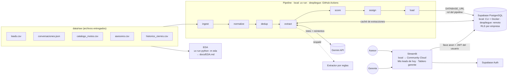

# TRD — Priorizador Diario de Leads

**Versión:** 1.3 · **Documentos complementarios:** [PRD.md](./PRD.md) (qué y por qué) · [EDA.md](./EDA.md) (evidencia de los datos, se genera en la Fase A)
**Convención:** los identificadores RF y RNF remiten a los requisitos del PRD.

**Cambios frente a la versión 1.2 (decisiones del punto de control A)**
- **Sección 10:** los leads sin cupo se siguen asignando solo por capacidad, pero se marcan como `prioritario` si son Caliente o si llevan menos de 24 h sin contacto. El tablero del gerente los muestra primero.
- **Sección 6.1:** nueva bandera `conversacion_antes_de_registro`.
- **Sección 5.2:** `cliente` usa `clave_dedup` (teléfono o email) como clave natural y admite `telefono` nulo, para aplicar la clave secundaria de la sección 7.
- **Sección 5.4:** `problema_calidad.empresa_id`, para que cada gerente vea solo los problemas de su empresa.
- **Sección 11.2:** `crear_usuarios_demo.py` se ejecuta después del pipeline, porque el usuario asesor referencia la tabla `asesor`.

**Cambios frente a la versión 1.1 (ajustes según el EDA)**
- **Sección 9.1:** el AUC de la regresión logística pasa a 0,548 y se especifican sus variables y su validación.
- **Sección 9.2:** la tasa de "no manifestó cuota" pasa a 8,3 %, calculada contra el resto (NO y NO_INFORMA).
- **Sección 17:**
  - 49 grupos duplicados, contados después de quitar las filas con `lead_id` repetido.
  - El 55 % sin contacto en 24 h se calcula con el método medianoche.
- **Sección 6:**
  - El diccionario de ciudades incluye `bogota` y `bogota d.c.`.
  - `capacidad_diaria_leads` se renombra en la ingesta.
  - Nueva validación cruzada `sin_gestion_con_contacto`.
- **Secciones 5.2, 6.2, 13 y 14:** disponibilidad del modelo en el punto de venta (`modelo_disponible_pv`), informativa para el asesor.
- **Secciones 2 y 4:** pandas 3.x, y nota sobre las llaves nuevas de Supabase.

**Cambios frente a la versión 1.0**
- El entorno de Python se gestiona con **uv**.
- La base de datos se desarrolla en local con **Supabase CLI**; las migraciones viven en `supabase/migrations/`.
- **Todo el desarrollo es local, incluida la app de Streamlit.** El despliegue ocurre en una fase posterior, solo cuando la solución local esté validada.
- Se agrega una **fase de EDA previa al desarrollo**, que sustenta las cifras del PRD y de este documento.
- Se formalizan las reglas de versionamiento: commits frecuentes, sin coautoría ni atribución de herramientas.
- Se agrega `CLAUDE.md` como guía del repositorio para el asistente de desarrollo.

---

## 1. Arquitectura

### 1.1 Entornos: local primero

| Componente | Fase local (desarrollo y validación) | Fase de despliegue (después de validar) |
|---|---|---|
| Ejecución del pipeline | `uv run python -m pipeline run` en la máquina del desarrollador | GitHub Actions (cron diario + disparo manual) |
| Base de datos | Supabase local (CLI + Docker) | Proyecto remoto de Supabase |
| Migraciones | `supabase db reset` | `supabase db push` |
| Autenticación | Supabase Auth local | Supabase Auth remoto |
| App | `uv run streamlit run app/streamlit_app.py` | Streamlit Community Cloud |
| Secretos | `.env` y `.streamlit/secrets.toml` (ignorados por git) | GitHub Secrets y `st.secrets` de Streamlit Cloud |

El código es el mismo en ambos entornos; solo cambian las variables de configuración (sección 4). La fase de despliegue no se inicia hasta cumplir la definición de terminado local (sección 16.1).

### 1.2 Diagrama



### 1.3 Principios de diseño

1. **Pipeline por etapas.** Cada etapa es un módulo con entradas y salidas explícitas (DataFrames o modelos Pydantic), y se puede probar por separado.
2. **Idempotente.** Toda escritura es un *upsert* por clave natural. Correr el flujo dos veces no duplica nada (RNF-03).
3. **Dos caminos de acceso a la base.** El pipeline escribe con credenciales de servidor. La app lee solo con la llave `anon` más el JWT del usuario, así que RLS siempre aplica (RNF-02).
4. **La IA es reemplazable.** Los extractores comparten una interfaz y un esquema de salida (RNF-06).
5. **Local primero y reproducible.** Cualquier persona con Docker, Supabase CLI y uv puede reconstruir todo desde cero con pocos comandos (RNF-12).
6. **Evidencia antes que código.** Las cifras que justifican el diseño salen de un EDA versionado (sección 17).

## 2. Stack

| Capa | Tecnología | Justificación |
|---|---|---|
| Lenguaje | Python 3.12 | Dominio del equipo, ecosistema de datos |
| Gestión del entorno | **uv** (`pyproject.toml` + `uv.lock`) | Instalación rápida, dependencias bloqueadas y reproducibles, grupos por uso |
| Manipulación de datos | pandas 3.x | Volumen pequeño (miles de filas). Los insumos se leen con `dtype="str"` y copy-on-write está activo |
| EDA | pandas, matplotlib, scikit-learn | Análisis reproducible por script, sin notebooks |
| Validación | Pydantic v2 | Esquema único para la extracción y validación de la salida del LLM |
| Coincidencia aproximada | rapidfuzz | Normalización de modelos determinística y explicable |
| LLM | Gemini, SDK `google-genai` (modelo configurable) | Tier gratuito, salida JSON con esquema |
| Reintentos | tenacity | Espera exponencial ante errores 429 y 5xx |
| Base de datos | Supabase (PostgreSQL), **local con Supabase CLI + Docker** | RLS nativo, Auth integrado; el mismo motor en local y en la nube |
| Driver | psycopg 3 | Cargas por lote y transacciones |
| Orquestación | CLI propia (`python -m pipeline`); en despliegue, GitHub Actions | Un solo disparo en local; cron y disparo manual en la nube |
| Front | Streamlit + `supabase-py`; local primero, luego Community Cloud | Desarrollo rápido, experiencia previa |
| Pruebas | pytest | Normalización, deduplicación, puntaje y aislamiento |
| Calidad de código | ruff | Estilo y errores comunes |

**Grupos de dependencias en `pyproject.toml`:**
- **Principales:** pandas, pydantic, psycopg[binary], rapidfuzz, google-genai, tenacity, python-dotenv.
- **`dev`:** pytest, ruff.
- **`eda`:** matplotlib, scikit-learn.
- **`app`:** streamlit, supabase.

**Prerrequisitos locales:** Docker en ejecución, Supabase CLI, uv y git.

## 3. Estructura del repositorio

```
motos-leads/
├── CLAUDE.md                     # guía del repositorio para el asistente de desarrollo
├── README.md
├── pyproject.toml
├── uv.lock
├── .python-version               # 3.12 (uv python pin)
├── .env.example
├── .gitignore
├── .githooks/commit-msg          # elimina líneas de coautoría o atribución
├── .claude/settings.json         # atribución de commits desactivada
├── .streamlit/secrets.toml.example
├── supabase/
│   ├── config.toml               # generado por supabase init
│   ├── migrations/
│   │   ├── <timestamp>_esquema.sql
│   │   ├── <timestamp>_rls.sql
│   │   └── <timestamp>_vistas.sql
│   └── seed.sql                  # datos de referencia que no vienen de los CSV
├── data/raw/                     # insumos sintéticos entregados (solo lectura)
├── eda/
│   ├── __main__.py               # uv run python -m eda
│   ├── comun.py                  # carga, intervalos y normalizaciones de medición
│   ├── perfil.py                 # perfil y calidad de datos
│   ├── historico.py              # tasas, intervalos, AUC, validación temporal
│   ├── conversaciones.py
│   └── reporte.py                # escribe docs/EDA.md
├── pipeline/
│   ├── __main__.py               # CLI: run | eval
│   ├── config.py
│   ├── db.py                     # conexión, upserts, registro de ejecución
│   ├── quality.py                # colector de problemas de calidad
│   ├── ingest.py
│   ├── normalize.py
│   ├── catalog_match.py
│   ├── dedup.py
│   ├── extract/
│   │   ├── schema.py
│   │   ├── base.py               # interfaz Extractor, caché por hash de contenido
│   │   ├── rules.py
│   │   ├── gemini.py
│   │   ├── consolidar.py         # señales por lead (8.4)
│   │   ├── etapa.py              # orquesta la extracción dentro del pipeline
│   │   └── prompts/extraccion_v1.md
│   ├── scoring.py
│   ├── assign.py
│   └── load.py                   # carga idempotente en la base (etapa load del diagrama 1.2)
├── scripts/
│   └── crear_usuarios_demo.py    # único lugar donde se usa service_role
├── evaluation/
│   ├── muestra_gold.py           # elige las 40 conversaciones de forma determinista
│   ├── gold_40_muestra.json      # los textos elegidos, sin etiquetas
│   ├── gold_40_borrador.json     # propuesta pendiente de revisión humana
│   ├── gold_40.json              # etiquetas revisadas
│   ├── eval_extraction.py
│   └── validate_scoring.py
├── app/
│   └── streamlit_app.py
├── tests/
├── docs/
│   ├── enunciado.pdf
│   ├── PRD.md
│   ├── TRD.md
│   ├── EDA.md                    # generado por el EDA
│   └── img/                      # gráficas del EDA y diagrama de arquitectura
└── .github/workflows/pipeline.yml   # se crea en la fase de despliegue
```

Si Streamlit Community Cloud requiere un archivo de dependencias, se genera en la fase de despliegue con `uv export`; nunca se edita a mano.

## 4. Configuración

| Variable | Local | Despliegue | Descripción |
|---|---|---|---|
| `DATABASE_URL` | `.env`, con el Postgres local que indica `supabase status` | GitHub Secrets, con la cadena del *pooler* (IPv4) | Solo la usa el pipeline |
| `SUPABASE_URL`, `SUPABASE_ANON_KEY` | `.streamlit/secrets.toml` (valores de `supabase status`) | `st.secrets` en Streamlit Cloud | Solo la app |
| `SUPABASE_SERVICE_ROLE_KEY` | `.env` | Variable local al crear usuarios remotos; no se guarda en la app | Solo `scripts/crear_usuarios_demo.py`. **Nunca** en la app |
| `DEMO_PASSWORD` | `.env` | Fuera del repositorio | Contraseña de los usuarios de demostración |
| `GEMINI_API_KEY` | `.env` | GitHub Secrets | Llave de Google AI Studio |
| `GEMINI_MODEL` | `.env` | Variable del workflow | Modelo que se usará; se elige según los límites vigentes en AI Studio |
| `EXTRACTOR` | `.env` | Entrada del workflow | `gemini` (por defecto) o `reglas` |
| `LLM_BATCH_SIZE` | `.env` | Igual | Conversaciones por petición; por defecto 10 |
| `LLM_MAX_RPM` | `.env` | Igual | Límite propio de peticiones por minuto; por defecto 5 |
| `FECHA_CORTE` | Argumento de la CLI o `.env` | Entrada del workflow | `YYYY-MM-DD`. Si está vacío, se usa la última fecha de registro |
| `VENTANA_DIAS` | `.env` | Igual | Antigüedad máxima de un lead abierto para entrar a la lista; por defecto 30 |

`.env` y `.streamlit/secrets.toml` están en `.gitignore`. El repositorio incluye `.env.example` y `.streamlit/secrets.toml.example`, solo con los nombres de las variables. Las llaves locales de Supabase también se tratan como secretos: no se escriben en el código.

**Llaves de Supabase.** Supabase CLI 2.x entrega dos juegos de llaves: las heredadas (`ANON_KEY`, `SERVICE_ROLE_KEY`) y las nuevas (`PUBLISHABLE_KEY`, `SECRET_KEY`). Este proyecto usa las heredadas, con los nombres de esta tabla, y las toma de `supabase status -o json`. Migrar a las nuevas solo cambia los valores y los nombres de las variables, no el código de acceso.

## 5. Modelo de datos

Zona horaria: todas las marcas de tiempo son `timestamptz`, con los datos de origen interpretados en `America/Bogota`.

El esquema se versiona como migraciones de Supabase CLI en `supabase/migrations/`. Se crean con `supabase migration new <nombre>`, se aplican en local con `supabase db reset` y en la nube con `supabase db push`. El historial de migraciones lo gestiona la propia CLI.

### 5.1 Tablas de referencia

```sql
empresa (
  empresa_id   text primary key,          -- EMP-01
  nombre       text not null,
  region       text                        -- Antioquia | Costa Atlántica | Bogotá
)

punto_venta (
  punto_venta_id text primary key,        -- PV-001
  empresa_id     text not null references empresa,
  ciudad         text                      -- inferida (ciudad más frecuente de sus leads)
)

asesor (
  asesor_id        text primary key,
  empresa_id       text not null references empresa,
  punto_venta_id   text not null references punto_venta,
  nombre           text not null,
  capacidad_diaria int  not null check (capacidad_diaria > 0),  -- capacidad_diaria_leads en asesores.csv
  activo           boolean not null,
  fecha_ingreso    date
)

modelo (
  sku                  text primary key,
  marca                text not null,
  linea                text not null,
  nombre_completo      text generated always as (marca || ' ' || linea) stored,
  cilindraje           int,
  segmento             text,
  precio_lista         bigint not null,
  unidades_disponibles int
)

modelo_punto_venta (
  sku            text references modelo,
  punto_venta_id text references punto_venta,
  primary key (sku, punto_venta_id)
)
```

### 5.2 Tablas de negocio

```sql
cliente (
  cliente_id     uuid primary key default gen_random_uuid(),
  empresa_id     text not null references empresa,
  clave_dedup    text not null,             -- 'tel:3001234567' o 'email:x@y.co' (sección 7)
  telefono       text,                      -- 10 dígitos; null si es inválido
  email          text,
  nombre         text not null,             -- el nombre más completo del grupo
  ciudad         text,
  unique (empresa_id, clave_dedup)          -- regla de deduplicación, por empresa
)

lead (
  lead_id                   text primary key,
  empresa_id                text not null references empresa,
  punto_venta_id            text not null references punto_venta,
  cliente_id                uuid not null references cliente,
  canal                     text not null check (canal in ('WhatsApp','Meta Ads','Formulario Web')),
  campania                  text,
  fecha_registro            timestamptz,
  fecha_registro_precision  text check (fecha_registro_precision in ('minuto','dia')),
  fecha_primer_contacto     timestamptz,
  fecha_contacto_precision  text,
  estado_gestion            text not null,  -- catálogo de 6 estados
  modelo_texto_original     text,
  sku_interes               text references modelo,
  marca_interes             text,
  match_modelo_score        numeric,
  modelo_disponible_pv      boolean,          -- el SKU está en el punto de venta del lead (null sin SKU); informativo
  es_principal              boolean not null default true,
  flags_calidad             text[] not null default '{}',
  actualizado_en            timestamptz default now()
)

conversacion (
  conversacion_id  text primary key,
  lead_id_origen   text not null,            -- tal como viene en el JSON
  lead_id          text references lead,     -- null si es huérfana
  empresa_id       text references empresa,  -- null si es huérfana (nadie la ve)
  fecha_inicio     timestamptz,
  hash_contenido   text not null,            -- sha256 de los mensajes
  es_huerfana      boolean not null
)

mensaje (
  conversacion_id text references conversacion on delete cascade,
  orden           int,
  emisor          text check (emisor in ('cliente','asesor')),
  hora            time,
  texto           text,
  primary key (conversacion_id, orden)
)
```

### 5.3 Tablas de resultados

```sql
extraccion (
  extraccion_id      bigserial primary key,
  conversacion_id    text not null references conversacion,
  empresa_id         text references empresa,
  hash_contenido     text not null,
  extractor          text not null check (extractor in ('gemini','reglas')),
  modelo_llm         text,
  prompt_version     text not null,
  modelo_texto       text,
  sku_interes        text references modelo,
  cuota_inicial_cop  bigint,
  menciona_cuota     text check (menciona_cuota in ('SI','NO','NO_INFORMA')),
  forma_pago         text check (forma_pago in ('contado','credito','no_informa')),
  intencion          text check (intencion in ('alta','media','baja')),
  objecion           text,                   -- enumeración de la sección 8.1
  pidio_cita         boolean,
  pidio_cotizacion   boolean,
  cliente_respondio  boolean,
  evidencia          jsonb,                  -- fragmentos que justifican cada campo
  creado_en          timestamptz default now(),
  unique (hash_contenido, extractor, prompt_version)   -- clave de caché
)

senales_lead (
  lead_id            text primary key references lead,
  empresa_id         text not null,
  modelo_texto       text,                   -- el último modelo que nombró el cliente
  sku_extraido       text references modelo,  -- ese texto resuelto contra el catálogo
  cuota_inicial_cop  bigint,
  menciona_cuota     text,
  forma_pago         text,
  intencion          text,
  objecion           text,
  pidio_cita         boolean,
  pidio_cotizacion   boolean,
  cliente_respondio  boolean,
  conversaciones     int    not null default 0,
  conversacion_ids   text[] not null default '{}',   -- para la evidencia y el chat completo
  actualizado_en     timestamptz default now()
)   -- señales de 8.4 ya consolidadas por lead: es lo que lee la app, para que muestre
    -- exactamente lo mismo que alimentó el puntaje en vez de reconstruirlo en SQL

score (
  lead_id           text references lead,
  fecha_corte       date,
  version_score     text,
  empresa_id        text not null,
  puntos_calidad    int,
  puntos_conversacion int,
  puntos_urgencia   int,
  prioridad         int,
  temperatura       text check (temperatura in ('Caliente','Tibio','Frío')),
  razones           jsonb,                   -- [{"factor":"pidió cita","puntos":3}, ...]
  primary key (lead_id, fecha_corte, version_score)
)

asignacion (
  fecha_corte  date,
  lead_id      text references lead,
  empresa_id   text not null,
  asesor_id    text references asesor,       -- null si quedó sin cupo
  orden        int,
  estado       text check (estado in ('asignado','sin_cupo')),
  prioritario  boolean not null default false,  -- Caliente o sin contacto con < 24 h (sección 10)
  primary key (fecha_corte, lead_id)
)

historico_cierre ( ... columnas del CSV ..., primary key (lead_id) )
```

### 5.4 Operación y seguridad

```sql
ejecucion (
  ejecucion_id  bigserial primary key,
  iniciado_en   timestamptz, finalizado_en timestamptz,
  estado        text,                        -- ok | error | ok_con_respaldo
  fecha_corte   date,
  disparador    text,                        -- schedule | manual
  conteos       jsonb,                       -- filas por etapa
  llamadas_llm  int, errores_llm int,
  detalle_error text
)

problema_calidad (
  id              bigserial primary key,
  ejecucion_id    bigint references ejecucion,
  empresa_id      text references empresa,   -- null si no se puede atribuir (p. ej. huérfanas)
  archivo         text, registro_id text, campo text,
  tipo            text,                      -- formato_fecha_ambiguo, telefono_invalido, ...
  valor_original  text, accion text
)

usuario_empresa (
  user_id    uuid primary key references auth.users,
  empresa_id text not null references empresa,
  rol        text check (rol in ('gerente','asesor')),
  asesor_id  text references asesor          -- obligatorio si el rol es asesor
)

```

## 6. Ingesta y normalización (RF-01 a RF-03)

`ingest.py` lee los archivos como texto (`dtype=str`) para no perder formatos originales. Cada regla de normalización que cambia o descarta un valor emite un registro en `problema_calidad`.

| Campo | Regla |
|---|---|
| `canal` | Minúsculas y sin espacios sobrantes, luego mapeo a `WhatsApp`, `Meta Ads` o `Formulario Web` |
| `estado_gestion` | Sin tildes y en minúsculas, luego mapeo a: `Sin gestión`, `No contesta`, `Contactado`, `En proceso`, `Cotización enviada`, `Descartado` |
| `telefono` | Solo dígitos; si tiene 12 dígitos y empieza por `57`, se quita el prefijo; válido si tiene 10 dígitos y empieza por `3`. Si no, se marca `telefono_invalido` |
| `email` | `strip().lower()`; validación básica de formato |
| `nombre` | Sin espacios sobrantes; formato título. Las variantes abreviadas ("F. Londoño") se conservan en el lead; el cliente toma la más larga |
| `ciudad` | Sin tildes y en minúsculas, luego diccionario de sinónimos (`b/quilla`→Barranquilla, `sta marta`→Santa Marta, `rio negro`→Rionegro, `bogota dc`, `bogota d.c.` y `bogota`→Bogotá D.C., `cartagena de indias`→Cartagena). Los nulos se quedan nulos |
| Registro de prueba | Se excluye si el nombre contiene "prueba" o el teléfono es inválido y el canal es nulo |
| Filas repetidas | Por `lead_id`, se conserva la primera y se registra `lead_repetido`. Se quitan **antes** de deduplicar |
| `asesores.csv` | `capacidad_diaria_leads` se renombra a `capacidad_diaria`; `activo` (`SI`/`NO`) pasa a booleano |

### 6.1 Fechas

Formatos detectados y cómo se interpreta cada uno:

| Patrón | Interpretación | Precisión |
|---|---|---|
| `YYYY-MM-DD HH:MM:SS` | ISO | minuto |
| `YYYY-MM-DDTHH:MM:SS` | ISO | minuto |
| `DD-MM-YYYY` | día-mes | **día** |
| `NN/NN/YYYY HH:MM` | **ambiguo**: se mezclan dd/mm y mm/dd | minuto |

Resolución del formato ambiguo, en este orden:

1. Si un componente es mayor que 12, la lectura queda determinada.
2. Si ambas lecturas son válidas, se descartan las que caen fuera de la ventana de datos (1 de agosto a 30 de septiembre de 2026).
3. Si ambas siguen siendo posibles, para `fecha_registro` se elige la que sea menor o igual a `fecha_primer_contacto`. Para `fecha_primer_contacto` se elige la que sea mayor o igual a `fecha_registro`.
4. Si persiste el empate, se usa dd/mm (convención colombiana) y se registra `fecha_ambigua_resuelta_por_defecto`.

Una fecha imposible (por ejemplo `2026-08-33`) se guarda como `null` con el registro `fecha_invalida`.

**Validaciones cruzadas** (solo generan banderas, no descartan):
- `contacto_antes_de_registro`: solo si ambas fechas tienen precisión de minuto. Con precisión de día, se compara por fecha.
- `estado_sin_fecha_contacto`: estado distinto de "Sin gestión" y sin fecha de contacto.
- `sin_gestion_con_contacto`: estado "Sin gestión" con fecha de primer contacto.
- `conversacion_antes_de_registro`: la conversación empieza en un día anterior al registro de su lead. Se compara por fecha, porque el registro puede tener precisión de día.

### 6.2 Modelo de interés (`catalog_match.py`)

1. **Limpieza:** minúsculas, sin tildes, `a.k.t`→`akt`, se elimina el año (`\b20\d{2}\b`), espacios colapsados.
2. **Coincidencia completa:** `rapidfuzz.process.extractOne` con `token_set_ratio` contra `marca linea`. Si el puntaje es al menos 85, se asigna el SKU (esto corrige, por ejemplo, "Suzuky GN 125").
3. **Coincidencia por línea:** si falla lo anterior, se compara solo contra `linea` con umbral de 90 (por ejemplo "TTR 200" → AKT TTR 200).
4. **Solo marca:** si el texto contiene únicamente una marca, o varias líneas empatan (por ejemplo "Bajaj Pulsar" corresponde a 3 líneas), se asigna `marca_interes`, el SKU queda nulo y se registra `modelo_ambiguo`.
5. **Nulo:** sin modelo, se registra `modelo_faltante`.
6. **Disponibilidad:** con SKU asignado, `modelo_disponible_pv` indica si el punto de venta del lead está en `puntos_venta_disponibles` del catálogo (tabla `modelo_punto_venta`). El dato es informativo: se muestra al asesor y no suma puntos.

Si la conversación trae un modelo con SKU, **prevalece sobre el del formulario** (paso de consolidación, sección 8.4).

## 7. Deduplicación (RF-04, RF-12)

**Clave:** `(empresa_id, telefono_normalizado)`. Nunca se agrupan leads de empresas distintas: los 91 teléfonos compartidos entre empresas generan clientes independientes.

**Clave secundaria:** si el teléfono es inválido pero el email es válido, se usa `(empresa_id, email)`.

**Confirmación:** dentro de un grupo se calcula la similitud del nombre, sin tildes, con `token_set_ratio`. Si es menor que 60, el grupo se conserva pero se marca `posible_colision_telefono` para revisión.

**Resultado:**
- Se crea un `cliente` por grupo.
- Todos los leads se conservan (trazabilidad) enlazados al cliente.
- Un solo lead por cliente queda con `es_principal = true`: el **más reciente que no esté descartado**. Solo ese entra al puntaje y a la asignación.
- Las señales de los demás leads del cliente se agregan al principal: extracciones de sus conversaciones, canales distintos y modelo más reciente.

## 8. Componente de IA: extracción (RF-05)

### 8.1 Esquema de salida (`extract/schema.py`)

```python
class Extraccion(BaseModel):
    conversacion_id: str
    modelo_texto: str | None          # el ÚLTIMO modelo de interés que menciona el cliente
    cuota_inicial_cop: int | None     # en pesos; 0 si dice que no tiene
    menciona_cuota: Literal["SI", "NO", "NO_INFORMA"]
    forma_pago: Literal["contado", "credito", "no_informa"]
    intencion: Literal["alta", "media", "baja"]
    objecion: Literal["precio", "tasa_cuota", "sin_inicial", "reporte_centrales",
                      "comparando", "consultar_familia", "prefiere_usada",
                      "tiempo_entrega", "solo_averiguando", "ninguna"]
    pidio_cita: bool                  # quiere visitar la sede o separar la moto
    pidio_cotizacion: bool
    cliente_respondio: bool           # False si solo hay mensajes del asesor tras el saludo
    evidencia: dict[str, str]         # campo -> fragmento textual breve
```

**Criterios de intención:**
- **Alta:** pide visita o separación, o dice "voy en camino" o "la necesito esta semana".
- **Baja:** "solo mirando", "por curiosidad", no responde, o se despide sin interés.
- **Media:** todo lo demás.

**Validación posterior (Pydantic y reglas):**
- `0 ≤ cuota_inicial_cop ≤ precio_lista`. Si la cifra supera el precio en **menos del 5 %** se entiende como redondeo del cliente ("7,2 millones" para una moto de 7.190.000) y se recorta al precio de lista; si lo supera por más, pasa a `null`. Un valor negativo también pasa a `null`.
- La tabla `extraccion` guarda la salida **tal como la produjo el extractor**: la validación se aplica en cada corrida antes de consolidar, para que los problemas de calidad sean los mismos se use o no la caché.
- `modelo_texto` se normaliza con `catalog_match`.
- Consistencia entre cuota y mención: `cuota > 0` implica `menciona_cuota = SI`, y `cuota = 0` implica `NO`.

### 8.2 Extractor con Gemini (`extract/gemini.py`)

- **Prompt versionado** en `prompts/extraccion_v1.md`. Contiene:
  - El rol del modelo.
  - Las definiciones de cada campo y los criterios de la sección 8.1.
  - Reglas explícitas para la jerga colombiana: "palos" y "millonzitos" equivalen a millones, "1500mil" equivale a 1.500.000, "0 millones" significa que no tiene inicial.
  - La regla de usar **el último modelo** mencionado por el cliente.
  - Tres ejemplos cortos (*few-shot*).
- **Salida estructurada:** `response_mime_type="application/json"` y `response_schema` con una lista de `Extraccion`. Temperatura 0.
- **Lotes:** `LLM_BATCH_SIZE` conversaciones por petición, cada una delimitada con su `conversacion_id`. Se valida que la respuesta traiga exactamente los mismos IDs; los faltantes se reintentan de forma individual.
- **Límite propio:** `LLM_MAX_RPM` con una pausa entre peticiones.
- **Reintentos:** `tenacity` con espera exponencial, máximo 5 intentos, ante errores 429 y 5xx. Si la petición falla por completo tras esos intentos, las conversaciones del lote **no** se piden una por una: repetirían el mismo error multiplicando la espera por el tamaño del lote. El reintento individual se reserva para las conversaciones que el modelo omitió en una respuesta que sí llegó.
- **Caché:** antes de llamar al LLM se consulta `extraccion` por `(hash_contenido, 'gemini', prompt_version)`. Solo se envían las conversaciones sin resultado. Cambiar el prompt obliga a subir `prompt_version`, lo que invalida la caché de forma controlada. Las filas de versiones anteriores **no se borran**: la tabla conserva qué respondió cada versión del prompt, así que conviven varias versiones de la misma conversación y toda consulta de estadísticas debe filtrar por `extractor` y `prompt_version`.
- **Respaldo:** si una conversación agota los reintentos o su respuesta no valida, se procesa con el extractor por reglas y se guarda con `extractor='reglas'`. La ejecución queda con estado `ok_con_respaldo`.

### 8.3 Extractor por reglas (`extract/rules.py`)

Usa expresiones regulares y listas de palabras clave sobre los mensajes del cliente:
- Montos con unidades: `mil`, `millones`, `palos`, `millonzitos`.
- Palabras de forma de pago: `contado`, `financiada`, `crédito`.
- Frases de cita: `visito`, `paso`, `voy`, `sepáremela`.
- Frases de objeción, según la sección 8.1.

Tiene dos funciones:
1. Respaldo operativo del extractor con LLM.
2. Línea base de la evaluación.

### 8.4 Consolidación por lead (`extract/consolidar.py`)

Para cada lead principal:
- Se toman las extracciones de todas las conversaciones de sus leads, con prioridad a la más reciente.
- `pidio_cita` y `pidio_cotizacion` se combinan con OR.
- Para la cuota se usa el último valor no nulo.
- Las conversaciones huérfanas (12, con `lead_id` inexistente) se cargan y se extraen, pero no se asocian a ninguna empresa.

### 8.5 Evaluación (`evaluation/eval_extraction.py`)

- **Conjunto de referencia:** 40 conversaciones, con una muestra estratificada que incluye cambios de modelo, jerga de montos, "0 millones", conversaciones sin respuesta del cliente y cada tipo de objeción.
  - El asistente de desarrollo genera `gold_40_borrador.json` con etiquetas propuestas, una justificación breve y `"revisado": false`.
  - Una persona revisa y corrige cada registro, y el resultado se guarda como `gold_40.json` con `"revisado": true`.
  - La evaluación solo usa registros revisados. En la documentación se declara que las etiquetas fueron propuestas por IA y revisadas por una persona.
- **Métricas:** exactitud por campo, y para la cuota, error absoluto con tolerancia del 5 %. Se calculan para `gemini` y para `reglas`.
- **Ruido de la medición:** con `temperature = 0` el modelo **no** es determinista. Dos corridas idénticas sobre las mismas 40 conversaciones difirieron en 4 de 360 campos (98,6 % y 99,2 %), siempre en casos límite. Por eso una diferencia menor de ~2 puntos entre dos versiones del prompt no es concluyente: hay que repetir la medición antes de declarar una mejora.
- **Sesgo del conjunto de referencia:** las etiquetas las propuso la IA con los mismos criterios que implementa `rules.py`, así que la columna `reglas` parte con ventaja. La cifra que informa sobre la calidad de la extracción con IA es la de `gemini`.
- **Salida:** una tabla en Markdown que se copia al README y se muestra en la app.
- **Uso:** los errores del LLM se analizan y alimentan la siguiente versión del prompt.

## 9. Puntaje y temperatura (RF-06, RF-07)

### 9.1 Enfoque

Se eligió un **puntaje aditivo por puntos** en lugar de un modelo entrenado, por tres razones:
- El histórico tiene poco poder predictivo: una regresión logística llega a un AUC de 0,548 y el puntaje simple a 0,584. La regresión usa canal, cuota inicial, forma de pago, cita y precio, con validación cruzada estratificada de 5 pliegues; con corte temporal llega a 0,581. Un modelo más complejo no aporta y resta explicabilidad.
- Los puntos se traducen directamente en razones legibles para el asesor.
- Los pesos se derivan de las tasas de cierre del histórico y se validan con un corte temporal.

**Preparación del histórico:**
- Se excluyen los 179 registros "Sin gestión", porque nunca fueron contactados: su desenlace no refleja la calidad del lead.
- `numero_contactos` **no se usa**: solo se conoce al final, así que sería fuga de información.

### 9.2 Componentes (`version_score = v1`)

**A. Calidad validada (0 a 9).** Estos pesos provienen del histórico. Tasa base con gestión: 9,75 %.

| Factor | Tasa si se cumple | Tasa si no | Puntos |
|---|---|---|---|
| Pidió cita | 11,8 % | 8,9 % | +3 |
| Manifestó cuota inicial | 11,8 % | 8,3 % (NO y NO_INFORMA) | +3 |
| Precio del modelo ≥ $10 M | 11,5 % | 8,5 % | +2 |
| Pago de contado | 11,8 % | 8,4 % (crédito) | +1 |

*Decisión documentada:* en el histórico, "forma de pago no informa" cierra 12,3 %, más que el crédito. No se premia porque no tiene una explicación de negocio plausible y probablemente es ruido. Sí se penaliza implícitamente el crédito, al no sumarle puntos.

**B. Ajuste conversacional (−3 a +3, heurístico).** Estos pesos no tienen validación histórica, porque el histórico no contiene esas señales.
- Intención alta: +2. Intención baja: −2.
- Objeción de reporte en centrales o de no tener inicial: −1.
- El cliente no respondió: −1.
- El cliente escribió por más de un canal: +1.

El resultado se recorta al rango [−3, +3]. Los pesos son pequeños a propósito, y en la app se marcan como heurísticos.

**C. Urgencia (0 a 5).** Se justifica con la relación entre horas al primer contacto y cierre en el histórico: 16,7 % a 1 hora, 7,4 % a 24 horas y 4,7 % a 120 horas.

| Situación del lead | Puntos |
|---|---|
| Sin contacto y menos de 2 h desde el registro | 5 |
| Sin contacto, entre 2 y 24 h | 4 |
| Sin contacto, entre 24 y 72 h | 2 |
| Sin contacto, más de 72 h | 1 |
| Cotización enviada (seguimiento de cierre) | 3 |
| En proceso o No contesta | 2 |
| Contactado | 1 |

Las horas se calculan como `momento_corte − fecha_registro`. `momento_corte` es **el registro más reciente que no pase del final del día de corte**, no el reloj del sistema: si se usara la hora real, el mismo lead cambiaría de puntaje en cada corrida y se rompería la idempotencia (RNF-03); y si se usara la medianoche del parámetro, los leads de ese mismo día tendrían horas negativas.

"Sin contacto" significa **estado `Sin gestión`**. Un lead cuyo estado ya avanzó pero que no tiene `fecha_primer_contacto` sí fue contactado —lo que falta es el dato, y por eso lleva la bandera `estado_sin_fecha_contacto`—, así que puntúa por su estado. Son 76 leads: tratarlos como no contactados le daría 5 puntos de urgencia a un lead cotizado hace un mes.

**Cálculo final**

```
temperatura = f(calidad + ajuste):   ≥ 6 Caliente · 3 a 5 Tibio · ≤ 2 Frío
prioridad   = calidad + ajuste + urgencia
orden       = prioridad desc, fecha_registro asc
```

`razones` guarda cada factor que sumó o restó puntos, con su valor. La app lo convierte en texto, por ejemplo: "Pidió cita (+3) · Cuota $2.000.000 (+3) · Sin contacto hace 3 h (+4)".

**Elegibilidad:** entran los leads principales cuyo estado es distinto de `Descartado` y cuya `fecha_registro` está dentro de `VENTANA_DIAS`.

**Limitación conocida:** los leads sin conversación (Meta y Web sin WhatsApp) solo pueden sumar calidad por precio, así que quedan como Tibio o Frío. Esto es coherente: no hay información para calificarlos más alto. La urgencia sigue ordenándolos.

### 9.3 Validación (`evaluation/validate_scoring.py`)

Aplica el componente A sobre el histórico con gestión (2.021 registros) y reporta los siguientes resultados. El EDA (sección 17) los confirmó:

| Temperatura | Tasa de cierre (todo el histórico) | n | Tasa en validación temporal (≥ 15 de junio) | n |
|---|---|---|---|---|
| Frío (≤ 2) | 7,3 % | 766 | 7,2 % | 221 |
| Tibio (3 a 5) | 9,9 % | 964 | 11,1 % | 271 |
| Caliente (≥ 6) | 15,8 % | 291 | 15,7 % | 83 |

- AUC: 0,577 en entrenamiento (antes del 15 de junio) y 0,602 en prueba. Los pesos se fijaron con criterio sobre las tasas agregadas, y el resultado es estable en el tiempo.
- **Criterio de aceptación:** la tasa Caliente debe ser al menos 1,8 veces la tasa Frío en la ventana de prueba. Resultado: 2,16 veces, así que **cumple**.

`uv run python -m pipeline validate-scoring` reproduce esta tabla completa desde los insumos y devuelve código distinto de cero si el criterio deja de cumplirse. Los pesos no se redefinen en el script: se importan de `pipeline/scoring.py`, que es la única fuente de esos números para el pipeline, el EDA y esta validación.

## 10. Asignación (RF-08)

El algoritmo `assign.py` recorre cada `punto_venta_id`:

1. Toma los leads elegibles ordenados por prioridad.
2. Toma los asesores con `activo = true` del punto de venta. Los asesores AS-037 y AS-040 quedan excluidos.
3. Reparte en **serpentina**: A, B, C, C, B, A… Así los primeros leads (los mejores) se distribuyen de forma equilibrada. Un asesor sale del reparto al alcanzar su `capacidad_diaria`. Los asesores se ordenan por `asesor_id` para que dos corridas con los mismos insumos produzcan el mismo reparto.
4. Los leads restantes quedan con `estado = 'sin_cupo'` y `asesor_id = null`, y aparecen en el tablero del gerente.
   - **Prioritarios:** `prioritario = true` si la temperatura es Caliente o si el lead no tiene contacto y lleva menos de 24 h desde el registro (la marca de urgencia de HU-03). El campo se calcula para todos los leads, asignados o no.
   - La marca **no** cambia la asignación: se reparte por prioridad y capacidad. En el tablero, los prioritarios sin cupo aparecen primero y resaltados, para que el gerente decida.
5. `orden` es la posición del lead dentro de la lista del asesor.

La asignación se recalcula completa para cada `fecha_corte`: se borra y se reinserta en una sola transacción. La asignación es estrictamente dentro del punto de venta y de la empresa; no se reparte entre empresas.

**Resultado de la corrida del 2026-09-10:** 981 leads elegibles, 637 asignados y 344 sin cupo, frente a una capacidad de 694 puestos entre los 40 asesores activos. Que sobren leads es el caso normal de operación, no un fallo: por eso existe `sin_cupo` y el tablero del gerente. De los 147 prioritarios, solo 1 quedó sin cupo, porque el orden por prioridad ya los coloca arriba.

## 11. Orquestación (RF-10)

### 11.1 CLI (igual en local y en despliegue)

`python -m pipeline` ofrece tres comandos:
- **`run`** ejecuta todas las etapas con un solo disparo. Acepta `--fecha-corte YYYY-MM-DD` y `--extractor gemini|reglas`.
  1. Abre un registro en `ejecucion`.
  2. Ejecuta las etapas en orden, con una transacción por etapa de carga.
  3. Cierra el registro con los conteos y el estado.
  4. Si ocurre un error no recuperable, sale con código distinto de cero.
- **`eval`** evalúa la extracción contra el conjunto de referencia revisado y escribe la tabla en la salida estándar. Con `--con-gemini` mide también el extractor con LLM, que consume cuota.
- **`validate-scoring`** valida el puntaje contra el histórico (9.3). Sale con código distinto de cero si no se cumple el criterio de aceptación, para que sirva de control en el despliegue.

Las migraciones **no** forman parte de la CLI: las gestiona Supabase CLI.

### 11.2 Fase local

Reconstrucción completa desde cero:

```bash
uv sync --all-groups                 # entorno bloqueado por uv.lock
supabase start                       # levanta Postgres, Auth y Studio en Docker
supabase db reset                    # aplica migraciones y seed.sql
uv run python -m eda                 # regenera docs/EDA.md (no usa la base)
uv run python -m pipeline run --fecha-corte 2026-09-10
uv run python scripts/crear_usuarios_demo.py   # después del pipeline: el usuario asesor referencia la tabla asesor
uv run python -m pipeline eval
uv run python -m pipeline validate-scoring
uv run streamlit run app/streamlit_app.py
```

En la fase local, el disparo único es `uv run python -m pipeline run`. Este comando cumple el requisito de automatización del enunciado, porque no exige pasos manuales intermedios. La programación diaria se agrega en la fase de despliegue.

### 11.3 Fase de despliegue (después de validar lo local)

1. Crear el proyecto remoto, vincularlo con `supabase link` y aplicar las migraciones con `supabase db push`.
2. Crear los usuarios de demostración en el proyecto remoto con el mismo script, apuntando a las variables remotas.
3. Configurar el workflow:

```yaml
# .github/workflows/pipeline.yml
name: pipeline-leads
on:
  schedule:
    - cron: "0 11 * * *"        # 06:00 America/Bogota
  workflow_dispatch:
    inputs:
      fecha_corte: { description: "YYYY-MM-DD (opcional)", required: false }
      extractor:   { description: "gemini | reglas", default: "gemini" }
concurrency: { group: pipeline-leads, cancel-in-progress: false }
jobs:
  run:
    runs-on: ubuntu-latest
    timeout-minutes: 30
    env:
      DATABASE_URL:   ${{ secrets.DATABASE_URL }}
      GEMINI_API_KEY: ${{ secrets.GEMINI_API_KEY }}
      GEMINI_MODEL:   ${{ vars.GEMINI_MODEL }}
      EXTRACTOR:      ${{ inputs.extractor || 'gemini' }}
      FECHA_CORTE:    ${{ inputs.fecha_corte }}
    steps:
      - uses: actions/checkout@v4
      - uses: astral-sh/setup-uv@v6
      - run: uv sync --frozen
      - run: uv run pytest -q
      - run: uv run python -m pipeline run
```

4. Publicar la app en Streamlit Community Cloud, con `SUPABASE_URL` y `SUPABASE_ANON_KEY` remotas en `st.secrets`. Si la plataforma exige un archivo de dependencias, se genera con `uv export`.
5. Verificar la definición de terminado de despliegue (sección 16.2).

Las versiones de las *actions* se confirman al crear el workflow.

**Evolución prevista:** un disparo por evento, con el workflow activado por `repository_dispatch` o un webhook cuando llegan archivos nuevos. Queda documentado como trabajo futuro.

## 12. Seguridad y aislamiento (RF-12, RNF-01, RNF-02)

```sql
-- <timestamp>_rls.sql (patrón; se aplica a cliente, lead, conversacion, extraccion, score, asignacion)
alter table lead enable row level security;

create policy lead_por_empresa on lead
  for select to authenticated
  using (empresa_id in (select empresa_id from usuario_empresa where user_id = auth.uid()));

-- mensaje hereda el aislamiento a través de conversacion
create policy mensaje_por_empresa on mensaje
  for select to authenticated
  using (exists (select 1 from conversacion c
                 where c.conversacion_id = mensaje.conversacion_id
                   and c.empresa_id in (select empresa_id from usuario_empresa
                                        where user_id = auth.uid())));
```

- **Sin acceso anónimo:** el rol `anon` no tiene políticas, así que no ve nada.
- **Solo lectura desde la app:** no hay políticas de `insert`, `update` ni `delete` para `authenticated`.
- **Vistas con RLS:** las vistas (`v_mis_leads_hoy`, `v_tablero_gerente`) se crean con `with (security_invoker = true)`. Sin esa opción, una vista se ejecuta con los permisos de su dueño e **ignora RLS**.
- **Filtro por rol de asesor:** una política adicional sobre `asignacion` limita al asesor a sus propias filas cuando `rol = 'asesor'`.
- **Huérfanas:** las conversaciones sin empresa (`empresa_id` nulo) no son visibles para nadie desde la app.
- **`service_role`:** se usa únicamente en `scripts/crear_usuarios_demo.py`, que crea un gerente por empresa y al menos un asesor de EMP-01. Las contraseñas se leen de `DEMO_PASSWORD`.
- **Prueba automática** (`tests/test_aislamiento.py`): corre contra el Supabase local. Inicia sesión como el gerente de EMP-01 y verifica que ninguna consulta devuelva filas de otra empresa, y que un teléfono compartido aparezca una sola vez para ese usuario.
- **Higiene de credenciales:**
  - Las llaves locales de Supabase también se tratan como secretos y no se escriben en el código.
  - Antes de publicar el repositorio se revisa el historial de git. Opcionalmente, se usa `gitleaks`.
  - Las credenciales de los usuarios de demostración se comparten fuera del repositorio.

## 13. Aplicación web (RF-11)

La app se desarrolla y valida en local (`uv run streamlit run app/streamlit_app.py`, contra el Supabase local). Solo después se publica en Streamlit Community Cloud, sin cambios de código: únicamente cambian los secretos.

`app/streamlit_app.py` funciona así:
- **Inicio de sesión:** `supabase.auth.sign_in_with_password`. La sesión se guarda en `st.session_state`, y todas las consultas usan ese cliente autenticado.
- **Vista "Mis leads de hoy"** (asesor, o gerente que elige un asesor de su empresa):
  - Selector de fecha de corte.
  - Tabla ordenada con temperatura (con color y texto), nombre, teléfono, modelo, cuota, forma de pago, horas sin contacto y estado.
  - Detalle desplegable con las razones del puntaje, los campos extraídos con su evidencia, la conversación completa, los otros leads del cliente y si el modelo de interés está disponible en el punto de venta.
- **Tablero del gerente:**
  - Carga asignada frente a capacidad por asesor.
  - Distribución por temperatura.
  - Leads sin cupo, con los prioritarios primero y resaltados.
  - Resumen de problemas de calidad.
- **Pestaña "Cómo prioriza":** la tabla de pesos, la validación histórica (sección 9.3), los hallazgos principales del EDA y los resultados de la evaluación del extractor.
- **Pie de página:** fecha y estado de la última ejecución, leídos de `ejecucion` a través de una vista limitada a esos campos.

## 14. Pruebas

Todas se ejecutan con `uv run pytest -q`. **Ninguna prueba llama a servicios externos:** el cliente de Gemini se simula.

| Archivo | Cubre |
|---|---|
| `test_normalize.py` | Los 7 formatos de teléfono, los 4 formatos de fecha (incluidos los casos ambiguos y la fecha inválida), el mapeo de canal, estado y ciudad |
| `test_catalog_match.py` | "Suzuky GN 125", "A.K.T Dynamic R3 125", "TTR 200", "Bajaj Pulsar" (ambiguo), "Honda" (solo marca), sufijo 2026, disponibilidad del SKU en el punto de venta |
| `test_dedup.py` | Agrupación por empresa, teléfono compartido entre empresas (no se fusiona), elección del lead principal |
| `test_rules_extractor.py` | Montos en jerga, "0 millones", cambio de modelo, conversación sin respuesta |
| `test_gemini_extractor.py` | Lotes, IDs faltantes, respuesta inválida, reintentos, caché y respaldo con reglas (todo simulado) |
| `test_scoring.py` | Casos puntuales de puntos, recorte del ajuste y umbrales de temperatura |
| `test_assign.py` | Respeto de la capacidad, exclusión de inactivos, serpentina, sin cupo |
| `test_aislamiento.py` | RLS de extremo a extremo contra Supabase local (se omite si no está en ejecución) |

## 15. Convenciones de desarrollo

### 15.1 Versionamiento

- **Commits pequeños y frecuentes**, uno por unidad lógica: una migración, un módulo con sus pruebas, un documento. Nunca un bloque completo en un solo commit.
- **Formato Conventional Commits:** el tipo en inglés (`feat`, `fix`, `test`, `docs`, `chore`, `refactor`) y la descripción en español, en imperativo. Ejemplo: `feat(normalize): resolver fechas ambiguas dd/mm y mm/dd`.
- **Sin coautoría ni atribución.** Los mensajes no incluyen `Co-Authored-By`, `Generated with ...` ni `Claude-Session`. El único autor es el usuario configurado en git. Se garantiza con tres capas:
  1. `.claude/settings.json` con `"attribution": {"commit": "", "pr": ""}`.
  2. La regla escrita en `CLAUDE.md`.
  3. El hook versionado `.githooks/commit-msg`, que elimina esas líneas. Se activa con `git config core.hooksPath .githooks`.
- **Nunca usar `--no-verify`**, porque saltaría el hook.
- **Sin push ni reescritura de historial** sin autorización explícita del responsable.
- **Antes de cada commit:** `uv run ruff check .`, `uv run ruff format .` y `uv run pytest -q`.
- **Verificación:** `git log --format=%B | grep -iE "co-authored|claude-session|generated with"` debe devolver vacío.
- **Ramas:** `main` siempre funcional, y ramas cortas por módulo cuando se trabaje en paralelo.

### 15.2 Entorno y código

- Todo se ejecuta con `uv run`. Las dependencias se agregan con `uv add` (o `uv add --group <grupo>`); `pyproject.toml` y `uv.lock` se versionan. No se usa `pip install`.
- `data/raw/` es de solo lectura.
- Nombres de dominio en español, como en este documento. Docstrings y comentarios en español. *Type hints* en las funciones públicas.
- Cualquier cambio de pesos o de prompt sube `version_score` o `prompt_version`, y se anota en el README.
- Ninguna cifra de la documentación se escribe a mano: debe salir de un script versionado (EDA o evaluación).

### 15.3 CLAUDE.md

Archivo en la raíz, de máximo 150 líneas. Contiene:
- Propósito del proyecto y enlaces a PRD, TRD y EDA.
- Comandos frecuentes (sección 11.2).
- Estructura del repositorio.
- Reglas obligatorias: versionamiento (15.1), secretos, `service_role` fuera de la app, vistas con `security_invoker`, pruebas sin red.
- Decisiones de dominio que no deben romperse:
  - Deduplicación solo dentro de la misma empresa.
  - Regla de resolución de fechas ambiguas.
  - El histórico se analiza sin "Sin gestión", y `numero_contactos` no se usa como predictor.
  - Pesos y prompt versionados.
  - El conjunto de referencia lo revisa un humano.
- Estado actual del proyecto, actualizado al cerrar cada fase.

## 16. Definición de terminado

### 16.1 Fase local (requisito para pasar al despliegue)

- [ ] `docs/EDA.md` generado por script, con la tabla de verificación de cifras y las discrepancias resueltas en PRD y TRD.
- [ ] Desde cero, `supabase db reset` seguido de `uv run python -m pipeline run` deja la base completa, y una segunda corrida no cambia los conteos.
- [ ] `uv run pytest -q` pasa, incluida la prueba de aislamiento contra Supabase local.
- [ ] La app local permite iniciar sesión con usuarios de dos empresas y demuestra el aislamiento.
- [ ] Conjunto de referencia revisado por un humano, y evaluación del extractor publicada (con Gemini, si la llave está disponible).
- [ ] Validación del puntaje publicada en el README y en la app.
- [ ] Historial con commits frecuentes y sin líneas de atribución.
- [ ] `CLAUDE.md` y README actualizados.

### 16.2 Fase de despliegue

- [ ] Migraciones aplicadas en el proyecto remoto con `supabase db push`.
- [ ] El workflow programado terminó con éxito al menos una vez, y también con disparo manual.
- [ ] La URL pública de Streamlit permite iniciar sesión con usuarios de dos empresas y demostrar el aislamiento.
- [ ] El repositorio remoto no contiene secretos, e incluye el README con las secciones que pide el enunciado.
- [ ] El diagrama de arquitectura y la presentación de 8 diapositivas están listos.
- [ ] Verificación de que la URL funciona el día anterior a la sustentación.

## 17. Análisis exploratorio (EDA) — Fase A

**Objetivo:** sustentar con evidencia reproducible las cifras del PRD y de este documento, y descubrir inconsistencias no documentadas **antes** de escribir el pipeline.

**Implementación:**
- Paquete `eda/`, ejecutable con `uv run python -m eda`, sin notebooks.
- Lee los insumos directamente de `data/raw/`; no usa la base de datos.
- Genera `docs/EDA.md` y las gráficas en `docs/img/eda/`.
- Es determinista: dos ejecuciones producen el mismo resultado.

**Contenido mínimo de `docs/EDA.md`:**

1. **Perfil de cada archivo:** filas, columnas, nulos, cardinalidad y valores distintos de los campos categóricos.
2. **Calidad de datos:** tabla con el problema, la cantidad de casos, un ejemplo y la resolución propuesta, para cada inconsistencia de las secciones 6 y 7. Incluye:
   - Conteo de fechas dd/mm, mm/dd y ambiguas, y cómo las resuelve la regla 6.1.
   - Cuántas variantes de modelo resuelve la regla 6.2.
   - Relación entre punto de venta, empresa y ciudad.
3. **Tabla de verificación de cifras.** Columnas: cifra citada, documento y sección, valor calculado, ¿coincide?. Cubre como mínimo:
   - Tasa base del histórico (9,0 %) y tasa con gestión (9,75 %).
   - Cierre por horas al primer contacto (16,7 % a 1 h, 7,4 % a 24 h, 4,7 % a 120 h).
   - Tasas de la tabla 9.2.
   - AUC de la regresión logística (0,548) y del puntaje v1 (0,584).
   - Resultados de la tabla 9.3, incluida la validación temporal.
   - 55 % de leads sin contacto en 24 h o nunca, con el método medianoche: las fechas con precisión de día se leen como 00:00 (PRD 2.1).
   - 91 teléfonos compartidos entre empresas y 49 grupos duplicados dentro de la misma empresa, contados después de quitar las filas con `lead_id` repetido; 28 de ellos son multicanal.
   - 12 conversaciones huérfanas y 25 leads con dos conversaciones.
   - Volumen diario de leads frente a capacidad de los asesores activos, por empresa.
4. **Histórico:**
   - Tasas por variable con tamaño de muestra e intervalos de confianza del 95 %.
   - Declaración explícita de las diferencias que no son estadísticamente significativas.
   - Justificación de excluir "Sin gestión" y de no usar `numero_contactos`.
5. **Conversaciones:** longitud, proporción sin respuesta del cliente, jerga de montos, cambios de modelo y frecuencia aproximada de cada objeción.
6. **Conclusiones para el diseño:** qué confirma el EDA, qué contradice y qué ajustes recomienda.

**Regla de discrepancias:** si una cifra no coincide, el análisis no se ajusta para que coincida. La diferencia se reporta con su causa probable, y la corrección del PRD o del TRD se aplica solo con aprobación del responsable.

## 18. Fases de implementación

| Fase | Contenido | Punto de control |
|---|---|---|
| A | Preparación del repositorio (uv, Supabase CLI, hook, `CLAUDE.md`) y EDA | Tabla de verificación de cifras e inconsistencias nuevas |
| B | Migraciones, RLS, vistas, usuarios de demostración, ingesta, normalización y deduplicación | Conteos por tabla, problemas de calidad, idempotencia |
| C | Extractores, consolidación y evaluación | Borrador del conjunto de referencia y exactitud provisional |
| D | Puntaje, validación, asignación y CLI completa | Validación del puntaje y distribución de la carga |
| E | App de Streamlit local, prueba de aislamiento y README | Reproducción desde cero y guion de demostración |
| F | Despliegue (sección 11.3) | Definición de terminado 16.2; **solo se inicia con 16.1 cumplida y con autorización** |
