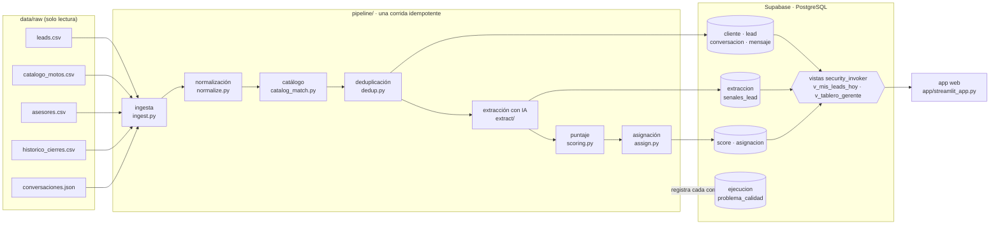
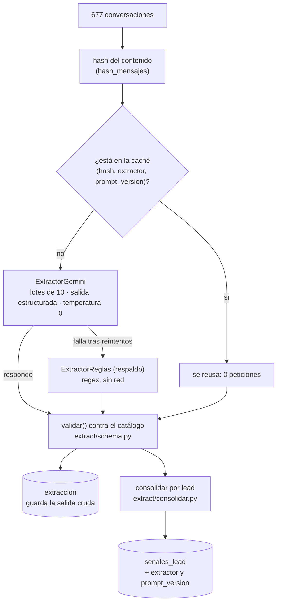
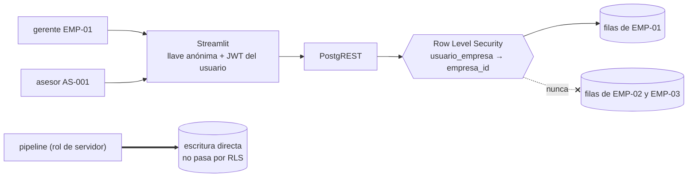

# Arquitectura — Priorizador Diario de Leads

Diagramas en Mermaid: GitHub los renderiza sin instalar nada. Cada bloque corresponde a un módulo
real del repositorio, y el nombre entre paréntesis es el archivo que lo implementa.

## 1. Flujo de punta a punta

Un solo comando —`uv run python -m pipeline run`— recorre todo el camino de izquierda a derecha.

**Por qué en este orden.** La extracción va después de la carga porque `extraccion` referencia
`conversacion` por llave foránea. El puntaje va después de la extracción porque consume las señales
consolidadas por lead, y la asignación va después del puntaje porque reparte una lista ya ordenada.

## 2. El componente de IA, en detalle

**Dos decisiones que se leen aquí.** La validación corre *siempre*, también sobre lo que viene de la
caché, para que los problemas de calidad no dependan de si la conversación se reevaluó. Y
`senales_lead` guarda su procedencia porque `extraccion` conserva todas las versiones cacheadas:
sin ese dato no se puede recuperar la evidencia que corresponde al puntaje que el asesor tiene
delante.

## 3. Aislamiento por empresa

El requisito «la información de una comercializadora no puede quedar visible para otra» se cumple
en la base, no en la interfaz.

| Quién | Con qué llave | Qué puede hacer |
|---|---|---|
| App web | anónima + JWT del usuario | Solo `select`, y solo de su empresa |
| Asesor | la suya | Únicamente las filas de `asignacion` con su `asesor_id` |
| Gerente | la suya | Toda su empresa |
| Pipeline | cadena de Postgres (servidor) | Escribe; RLS no le aplica |
| `crear_usuarios_demo.py` | `service_role` | Único lugar del repositorio que la usa |

Las vistas se crean con `security_invoker = true`: sin esa opción una vista corre con los permisos
de quien la creó y se saltaría las políticas.

## 4. Componentes y responsabilidades

| Componente | Archivo | Responsabilidad |
|---|---|---|
| Ingesta | `pipeline/ingest.py` | Leer los cinco insumos como texto, sin interpretar |
| Normalización | `pipeline/normalize.py` | Teléfono, fecha ambigua, ciudad, estado y canal |
| Catálogo | `pipeline/catalog_match.py` | Resolver el modelo en texto libre contra los 24 SKU |
| Deduplicación | `pipeline/dedup.py` | Una persona por empresa, aunque escriba por dos canales |
| Extracción | `pipeline/extract/` | Dos implementaciones tras una interfaz, con caché y respaldo |
| Puntaje | `pipeline/scoring.py` | Calidad + conversación + urgencia, con sus razones |
| Asignación | `pipeline/assign.py` | Serpentina por punto de venta, respetando la capacidad |
| Persistencia | `pipeline/load.py`, `pipeline/db.py` | Upserts por clave natural, idempotentes |
| Interfaz | `app/streamlit_app.py` | Lista del asesor, tablero del gerente y método |
| Evaluación | `evaluation/` | Extracción contra el conjunto revisado; puntaje contra el histórico |
